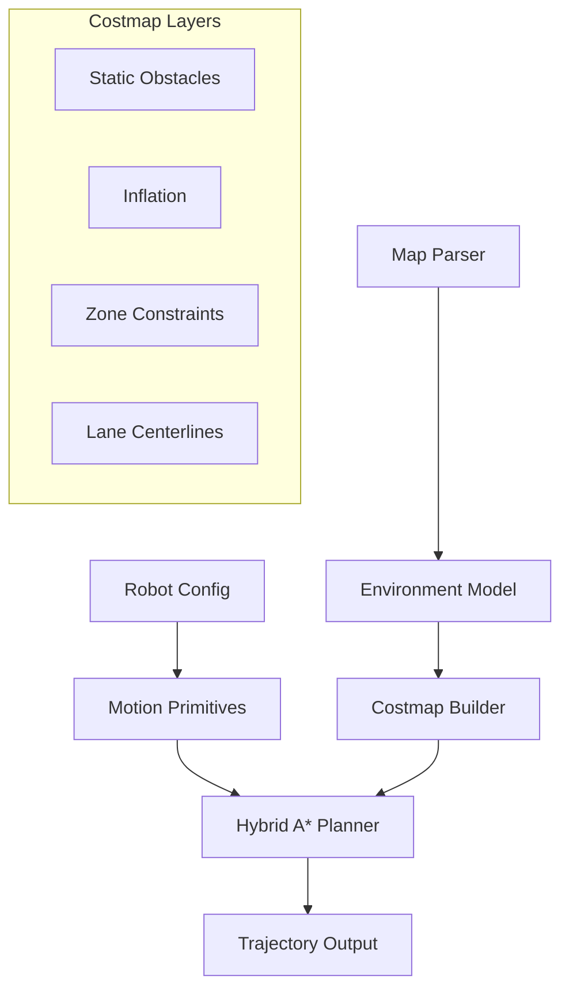

# CoastMotionPlanning

High-performance, zone-aware Hybrid A* motion planning for Ackermann-steered robots.


## 🌊 Overview

**CoastMotionPlanning** is a specialized navigation library designed for precise motion generation in complex environments. It leverages the **Hybrid A*** algorithm to produce kinematically feasible trajectories for robots with steering constraints (like cars and truck-trailers).

The system is "zone-aware," meaning it adjusts its planning behavior (e.g., forward-only constraints, cost functions) based on the semantic region of the map the robot is currently occupying.

## 🚀 Key Features

- **Kinematically Feasible Planning**: Native support for Ackermann steering constraints using Hybrid A*.
- **Multi-Robot Support**: Optimized models for both single-unit cars and articulated truck-trailer systems.
- **Zone-Aware Logic**:
    - **Maneuvering Zones**: Allow complex forward/reverse maneuvers.
    - **Track Main Roads**: Enforce efficient, forward-only motion along lane centerlines.
- **High-Performance Costmaps**: Multi-layered costmaps built on `grid_map_core` and `Eigen`, featuring static obstacles, inflation, and semantic constraints.
- **Precomputed Motion Primitives**: Uses lookup tables to eliminate runtime trigonometric overhead during search.

## 🏗️ Architecture



## 🛠️ Build & Installation

### Dependencies

- **C++17** Compiler
- **CMake** >= 3.18
- **Boost** (System, Filesystem)
- **Eigen3** (Fetched automatically)
- **yaml-cpp** (Fetched automatically)
- **grid_map_core** (Fetched automatically)
- **GTest** (Fetched automatically for tests)

### Compilation

```bash
mkdir build && cd build
cmake ..
make -j$(nproc)
```

### Running Tests

```bash
cd build
ctest --output-on-failure
```

## 📁 Directory Structure

- `apps/`: Main application entry points and demonstrations.
- `configs/`: YAML definitions for robots, maps, and planner behaviors.
- `include/`: Header files organized by component.
- `src/`: Core implementation of the planning pipeline.
- `tests/`: GTest unit and integration tests.
- `docs/`: Supplemental design documents and references.

---

*Developed for high-precision autonomous navigation.*
